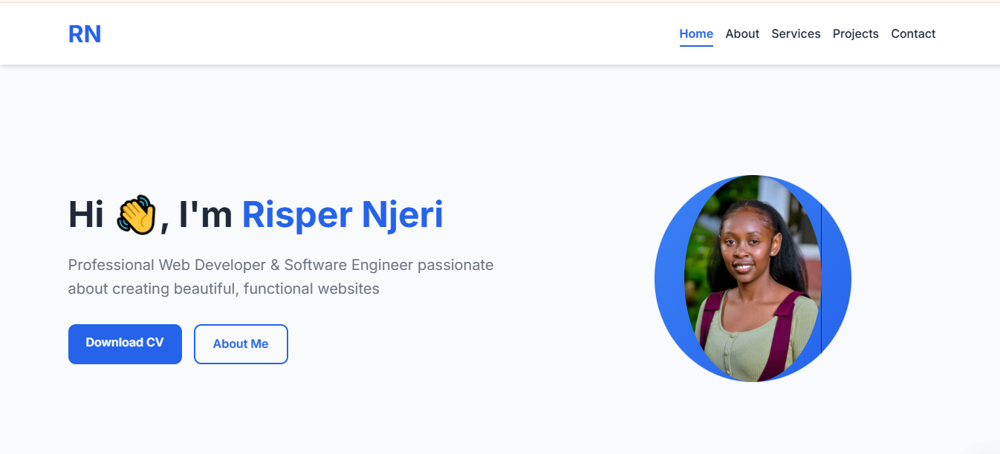

# Risper Njeri Portfolio

Welcome to my professional portfolio 👩‍💻 This website showcases my skills, projects, and services as a Web Developer and Software Engineer.

[](LICENSE)

## Features

- ✅ Fully responsive design
- ✅ Clean, semantic HTML5
- ✅ Modern CSS with Flexbox and Grid
- ✅ Interactive elements with CSS animations
- ✅ Accessible and SEO-friendly

## Screenshots


_Homepage with hero section_

## Technologies Used

- HTML5
- CSS3 (Flexbox, Grid, Animations)
- Responsive Design (Mobile-first approach)
- Git for version control

## Installation Steps

Follow these steps to set up the project locally:

1. **Clone the Repository**:

   ```bash
    👉 git clone https://github.com/your-username/portfolio-pro.git
   ```

   Replace `your-username` with your GitHub username.

2. **Navigate to the Project Directory**:

   ```bash
     👉 cd portfolio-pro
   ```

3. **Open the Project in a Code Editor**:
   Open the folder in your preferred code editor (e.g., VS Code).

4. **Start a Local Server**:

   - If you have the **Live Server** extension in VS Code:
     - Right-click on `index.html` and select **Open with Live Server**.
     Then open `http://localhost:8000` in your browser.

5. **View the Website**:
   Open the `index.html` file in your browser to view the portfolio.
